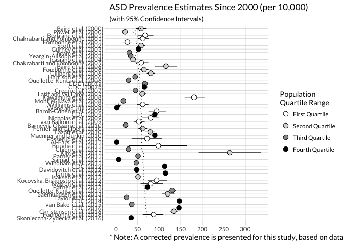

# asd-prevalence-estimates
Alison Hill  


<style>
body {
    font-family: "Cabin", sans-serif;
}
p {
    font-family: "Cabin", sans-serif;
}
</style>

<a href="mailto:hillali@ohsu.edu"><i class="fa fa-envelope fa-fw"></i>&nbsp; hillali@ohsu.edu</a><br>


```r
# import Data
epi <- read_csv("./data/prevalence-hollander-tidy.csv")

# create discrete variable for scale_fill_manual
epi <- epi %>%
  mutate(quartile = ntile(pop, 4))

head(epi)
```

```
# A tibble: 6 × 27
     X1  year                  authors country   pop lowerage upperage
  <int> <int>                    <chr>   <chr> <int>    <dbl>    <dbl>
1     1  2000             Baird et al.      UK 16235      7.0      7.0
2     2  2000            Powell et al.      UK 58654      1.0      5.0
3     3  2001          Bertrand et al.     USA  8896      3.0     10.0
4     4  2001 Chakrabarti and Fombonne      UK 15500      2.5      6.5
5     5  2001          Fombonne et al.      UK 10438      5.0     15.0
6     6  2002             Scott et al.      UK 33598      5.0     11.0
# ... with 20 more variables: medianage <dbl>, asdn <int>, normaliq <dbl>,
#   gender <dbl>, report_prev <dbl>, `95ci` <chr>, l95 <dbl>, u95 <dbl>,
#   icd_10 <int>, dsm_iii <int>, dsm_iv <int>, dsm_iv_tr <int>,
#   dsm_five <chr>, screener <chr>, study <chr>, crude_prev <dbl>,
#   true_prev <dbl>, cum_mean <dbl>, order <int>, quartile <int>
```

```r
#Create caption for changed prevalence rate in Wong and Hui (2008)
caption <- "* Note: A corrected prevalence is presented for this study, based on data reported in Wong & Hui (2008)."
caption <- paste0(strwrap(caption, 120), sep="", collapse="\n")
```


This chunk is needed to get the ordering of the y-axis by year from earliest (top) to most recent (bottom).


```r
#sort using base R
epi$study <- factor(epi$study, 
                       levels = epi$study[order(epi$year)])
```


```r
#Discrete Grayscale by Population IQR with Cumulative Mean
fig02 <- ggplot(data=epi, aes(x = true_prev, y = study, group = 1))
fig02 <- fig02 + geom_errorbarh(aes(xmin=l95, xmax=u95), height=0,size=.4, na.rm=TRUE)
fig02 <- fig02 + geom_point(aes(fill=factor(quartile)), size=3, shape=21, colour="black", alpha=1, na.rm=TRUE) 
fig02 <- fig02 + geom_path(aes(x = cum_mean, y = order), linetype="dotted") 
fig02 <- fig02 + scale_y_discrete(limits = rev(levels(epi$study)), name = "")
fig02 <- fig02 + scale_fill_manual(limits= c(1:4),
                                       breaks= c(1:4),
                                       values= c("#FFFFFF", "#d9d9d9", "#969696", "#000000"),
                                       labels= c("First Quartile", "Second Quartile", 
                                                 "Third Quartile", "Fourth Quartile"),
                                       name="Population \nQuartile Range")
fig02 <- fig02 + scale_x_continuous(breaks= seq(0,300, by=50))
fig02 <- fig02 + labs(x=NULL, y=NULL,
                          title="ASD Prevalence Estimates Since 2000 (per 10,000)",
                          subtitle="(with 95% Confidence Intervals)",
                          caption=caption)
fig02 <- fig02 + annotate('text', x = 7, y = 32.9, label = "*", size=7) #for Note on Wong & Hui (2008)
fig02 <- fig02 + theme_minimal(base_family="Lato")
fig02 <- fig02 + theme(panel.grid=element_line(),
                           panel.grid.major.y=element_line(color="#bdbdbd", size=0.15), 
                           panel.grid.major.x=element_line(color="#d9d9d9", size=0.15), 
                           panel.grid.minor.x=element_blank(), 
                           panel.grid.minor.y=element_blank(), 
                           axis.line=element_line(), 
                           axis.line.x=element_blank(), # if wanted, (color="#2b2b2b", size=0.15)) 
                           axis.line.y=element_blank(), #if wanted, (color="#2b2b2b", size=0.15))
                           axis.ticks=element_line(), 
                           axis.ticks.x=element_line(color="#bdbdbd", size=0.15), 
                           axis.ticks.y=element_line(color="#bdbdbd", size=0.15), 
                           axis.ticks.length = unit(.25, "cm"), 
                           axis.text.y=element_text(margin=margin(r= 2)),
                           plot.title=element_text(family="Lato"), 
                           plot.subtitle=element_text(family="Lato"),
                           plot.caption=element_text(size=11, hjust=0))
fig02
```

<!-- -->

The above figure will not look right. The final figure is a pdf, which we export here.


```r
sink_fig <- "./figs/fig02_asd_prevalence_estimates.pdf"

# save as pdf
ggsave(fig02, file = sink_fig, height=9, width=12, dpi = 600)

# embed font to keep them for pdf
embed_fonts(sink_fig)
```


