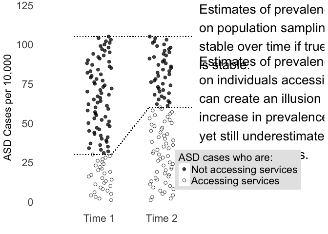

# Figure 3
Alison Presmanes Hill  


<style>
body {
    font-family: "Cabin", sans-serif;
}
p {
    font-family: "Cabin", sans-serif;
}
</style>

<a href="mailto:hillali@ohsu.edu"><i class="fa fa-envelope fa-fw"></i>&nbsp; hillali@ohsu.edu</a><br>


```r
# load data files & rename cols
cdc <- read_csv("./data/cdc_addm_all.csv", col_names = TRUE)

# filter sites 
fig03_for_plot <- cdc %>%
  filter(!(site %in% c("Total", "Florida", "Pennsylvania")))


# small multiples plot
cols <- c("black", "white")
fig03 <- ggplot(fig03_for_plot) 
fig03 <- fig03 + geom_line(aes(group = for_line, x = year_survey, y = prevalence_1000, colour = data_source), lty = 3) 
fig03 <- fig03 + geom_linerange(aes(x = year_survey, y = prevalence_1000, ymin = l95_1000, ymax = u95_1000,  colour = data_source), size = .65, fatten = 2) 
fig03 <- fig03 + geom_point(aes(x = year_survey, y = prevalence_1000, fill = data_source), pch= 21, size = 2.5)
fig03 <- fig03 + facet_wrap(~ site) 
fig03 <- fig03 + scale_x_continuous(breaks = c(2006, 2008, 2010, 2012), name = "fig03 Survey Year") 
fig03 <- fig03 + scale_color_manual(values = c("black", "black"), guide= FALSE) 
fig03 <- fig03 + scale_fill_manual(values = cols, name = "Record Source", labels = c("Educational + Health", "Health only")) 
fig03 <- fig03 + expand_limits(x = c(2005, 2013), y = 0) 
fig03 <- fig03 + scale_y_continuous(name = "Prevalence per 1000 children aged 8 years (95% CI)") 
fig03 <- fig03 + theme_hc()  
fig03 <- fig03 + labs(title = "Prevalence of Autism Spectrum Disorder Among Children Aged 8 Years in the US Across 4 Survey Years", subtitle = "Content source: CDC Autism and Developmental Disabilities Monitoring (fig03) Network")
fig03 <- fig03 + theme(plot.title=element_text(face="bold", size=10, margin=margin(b=6)))
fig03 <- fig03 + theme(panel.grid.major.y = element_line(size = .25))
fig03 <- fig03 + theme(axis.ticks = element_blank())
fig03 <- fig03 + theme(plot.subtitle=element_text(size=8))
fig03
```

<!-- -->

The above figure will not look right. The final figure is a pdf, which we export here.


```r
sink_fig <- "./figs/fig03_addm_records_by_source.pdf"

# save as pdf
ggsave(fig03, file = sink_fig, height=9, width=12, dpi = 600)

# embed font to keep them for pdf
embed_fonts(sink_fig)
```
